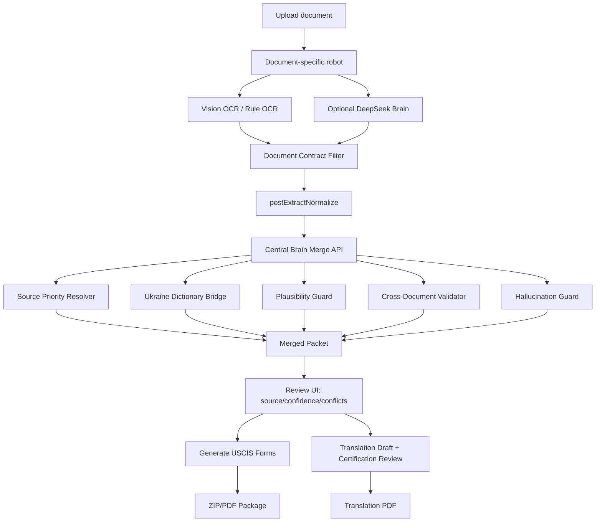

# ARCHITECTURE_GAP_AUDIT_2026-05-26

## Executive verdict
**Overall:** DEGRADED.  
Причина: `origin/main` чистый и зелёный, но локальный workspace содержит несинхронизированные dirty-патчи (DOB/provenance/tests/docs), а часть ключевых утверждений существует только как исторический evidence или как локальный незакоммиченный код.  
Критичный разрыв архитектуры подтверждён: TPS pipeline и Translation Engine реализованы как отдельные подсистемы без runtime-координатора уровня Central Brain.

## Repo state
- `HEAD`: `08b4132a63eed0563f45e0c96f8044b6b642f8b2`
- `origin/main`: `08b4132a63eed0563f45e0c96f8044b6b642f8b2`
- `HEAD == origin/main`: yes
- working tree: dirty
- tracked modified: `STATUS.md`, `HANDOFF.md`, `CHANGELOG.md`, TPS DOB/provenance файлы и тесты
- untracked: `apps/web/tests/e2e/booklet-only-pdf-proof.spec.ts`, `docs/reports/TRUTH_LEDGER_2026-05-26.md`, historical evidence bundles

## Spec timeline: historical spec vs audit correction vs accepted dictionary
- `TPS_ROBOT_ENGINEERING_SPEC_V1_1.docx` и `PROJECT_HISTORY.md` (94.4%, 10/10 phases) — historical baseline, не текущая runtime-truth по умолчанию.
- `docs/adr/ADR-CENTRAL-BRAIN.md` — **PROPOSED**, не реализованная runtime-архитектура.
- `docs/adr/ADR-002-ukraine-dictionary-v1.2.md` — **Accepted**, canonical rules в `packages/knowledge`.
- `docs/reports/TRUTH_LEDGER_2026-05-26.md` и свежие `STATUS/HANDOFF/CHANGELOG` корректно разделяют historical vs dirty-local vs runtime.

## What is already implemented

| feature | code exists | used by TPS runtime | tested | live/e2e evidence | verdict |
|---|---|---|---|---|---|
| OCR endpoint + slot routing | `apps/web/src/app/api/tps/ocr/extract/route.ts` | yes | yes | yes | VERIFIED |
| Passport MRZ extraction | `apps/web/src/lib/tps/modules/passport.ts` | yes | yes | multi-doc e2e historical | VERIFIED |
| I-94 extraction | `apps/web/src/lib/tps/modules/i94.ts` | yes | yes | multi-doc evidence | VERIFIED |
| EAD extraction | `apps/web/src/lib/tps/modules/ead.ts` | yes | yes | multi-doc evidence | VERIFIED |
| DL extraction | `apps/web/src/lib/tps/modules/dl.ts` | yes | yes | multi-doc evidence | VERIFIED |
| I-797 extraction | `apps/web/src/lib/tps/modules/i797.ts` | yes | yes | multi-doc evidence | VERIFIED |
| Booklet extraction (UA internal passport) | `apps/web/src/lib/tps/modules/passportBooklet.ts` + dual crossref in OCR route | yes | yes | historical OCR response shows booklet fields | VERIFIED (with caveats) |
| Contract filter by slot | `apps/web/src/lib/tps/ocr/documentContracts.ts` | yes | yes | rejected_fields in audit JSON | VERIFIED |
| postExtract normalization | `apps/web/src/lib/tps/ocr/postExtractNormalize.ts` | yes | yes | diagnostics in OCR response/audit | VERIFIED |
| Client merge + source arbitration | `TPSWizardV2.tsx` + `fieldArbiter.ts` | yes | yes | e2e + payload traces | VERIFIED |
| Provenance sidecar build | `apps/web/src/lib/tps/provenance.ts` | yes | yes | payload `_provenance` evidence | VERIFIED (bug history exists) |
| Generate ZIP/PDF | `/api/tps/generate-packet` | yes | yes | ZIP/PDF artifacts/readback | VERIFIED |
| OCR audit logging | `logOcrRun` via OCR route | yes | partial | audit rows JSON | PARTIAL (live DB queries are historical snapshots) |
| Translation engine modules (anchor, glossary, evidence review, renderer) | `apps/web/src/lib/translation/**` | yes (translation service) | yes | code/docs present | VERIFIED |
| Shared dictionary package | `packages/knowledge` | partially | partial | tests in package + imports in TPS | PARTIAL |

## What is not implemented

| missing module | why it matters | current workaround | risk | recommended phase |
|---|---|---|---|---|
| Server Central Brain API (`POST /api/tps/brain/merge`) | нет единой server-side merge truth | client-side `resolveAllFields` in `TPSWizardV2` | state drift, weak reproducibility | Phase 5 |
| `centralBrain.ts` orchestrator | нет единого conflict pipeline | distributed logic in route + wizard + arbiter | hard to audit | Phase 5 |
| Unified sourcePriority module | priorities захардкожены в `fieldArbiter.ts` | local constants only | scenario confusion | Phase 5 |
| Cross-document validator module | нет выделенного consistency layer | ad-hoc conflict notes in arbiter | silent conflicts | Phase 5 |
| Hallucination guard module | нет отдельного reject pipeline | partial checks in `fieldArbiter`/normalizers | AI garbage leak risk | Phase 5 |
| DictionaryBridge TPS↔Translation | Translation glossary/identity не подключены в TPS merge path | TPS uses own flow + some `@uscis-helper/knowledge` calls | duplicated semantics | Phase 6 |
| Conflict/evidence review unified UI | user sees partial provenance only | current review rows + banners | low forensic clarity | Phase 5/7 |
| Handwritten confidence + retry policy unified | есть куски, но не единый coordinator policy | thresholds in multiple places | inconsistent reject behavior | Phase 5/6 |
| Translation certification workflow enforcement | USCIS rule needs human certification | content guards + disclaimers | legal/compliance ambiguity | Phase 7 |

## Where the errors are

| severity | error | evidence | consequence | fix direction |
|---|---|---|---|---|
| High | Components exist but are not connected by one coordinator | `ADR-CENTRAL-BRAIN` says PROPOSED; no `centralBrain.ts`/`/api/tps/brain/merge` in code search | merge truth fragmented | build Central Brain v0 |
| High | Merge is client-side | `TPSWizardV2.tsx` builds `mergedFields` via `resolveAllFields` in `useMemo` | runtime depends on UI state/order | move merge to server packet |
| High | Multi-doc scenario used as booklet-origin proof | `booklet-review.spec.ts` uploads passport+booklet+i94+ead+dl | false provenance conclusions | enforce scenario separation |
| High | Historical DOB failure mixed with dirty local patch truth | `phaseC_fresh_ocr_response.json` shows `dob` rejected + parse fail; dirty files allow dob/parse UA | contradictory reporting | split by time/source in docs and commits |
| Medium | Provenance mapping bug history (`booklet` mapped to manual) | dirty `provenance.ts` delta + STATUS notes | booklet source could be mislabeled | isolate/fix as standalone commit |
| Medium | Translation glossary bypass paths still documented | `SOURCE_OF_TRUTH.md` KNOWN BYPASS PATHS | semantic drift (`Militsiya` etc.) | migrate to dictionary bridge |

## Why the system components do not see each other
1. TPS flow решает extraction/merge/generate в своём контуре (`/api/tps/ocr/extract` + `TPSWizardV2` + `/api/tps/generate-packet`).
2. Translation Engine живёт в отдельном контуре (`/api/translation/*`, `PacketIdentityAnchor`, `EvidenceReviewPage`, `agencyGlossary`).
3. Нет runtime-boundary контракта, который бы:
   - принимал slot outputs от TPS robots,
   - вызывал dictionary/validators единообразно,
   - отдавал `mergedPacket` и conflict model как server-truth.
4. Следствие: одна и та же доменная семантика (patronymic, historical authority, geography) потенциально интерпретируется в двух контурах по-разному.

## TPS vs Translation Engine integration gaps
- Translation has: `PacketIdentityAnchor`, `agencyGlossary`, `nominativeCaseRestorer`, `correctionClassifier`, `EvidenceReviewPage`.
- TPS runtime does **not** import `PacketIdentityAnchor` path.
- TPS partially uses `@uscis-helper/knowledge` (`postExtractNormalize.ts`, `visionBridge.ts`, `TPSWizardV2.tsx` for oblast normalization), но не использует translation-layer reviewer/certification model.
- Gap: нет единого dictionary bridge policy между form-fill и translation draft.

## Ukrainian handwritten/cyrillic passport/booklet gap
- Historical production evidence (`phaseC_fresh_ocr_response.json`) показывает:
  - raw OCR содержит `01 січня 1990 року`,
  - `brain.validated_skipped` содержит `dob/date not parseable`,
  - contract rejected `dob` for booklet at that time.
- Dirty local code now includes:
  - explicit UA month parser in `documentBrain.ts`,
  - `booklet.allowed_fields` includes `dob` in `documentContracts.ts`.
- Verdict:
  - parser/contract fix exists in local dirty state;
  - current production runtime proof for this fix отсутствует в данном аудите.

## Scenario separation: booklet-review vs booklet-only
- `booklet-review.spec.ts` (multi-doc) validates end-to-end generation, но **не** доказывает booklet-origin `family_name` (арбитр по дизайну предпочитает MRZ/DL для STRONG_IDENTITY).
- `booklet-only-pdf-proof.spec.ts` — единственный валидный strict scenario для доказательства booklet provenance (`_provenance.family_name.source_document_type='booklet'`), если proof-fields не редактируются вручную.

## Central Brain target architecture

## Minimal Central Brain v0
- Scope only load-bearing fields first: `family_name`, `given_name`, `dob`, `passport_number`, `middle_name`, `city_of_birth`, `province_of_birth`.
- Output contract:
  - `MergedField { field, value, source_document_type, extraction_method, confidence, review_required, conflict, rejected_candidates[], notes[] }`
- Input contract:
  - per-slot normalized candidates + diagnostics from OCR route.
- Non-goals v0:
  - full translation rendering orchestration,
  - broad refactor of all form maps,
  - replacing all legacy translation modules in one shot.

## Implementation sequence
- Phase 0: truth-ledger reconciliation only (already done).
- Phase 1: commit DOB parser/validation patch (isolated).
- Phase 2: commit provenance booklet mapping patch (isolated).
- Phase 3: strict booklet-only e2e proof with provenance gate.
- Phase 4: deploy approved patchset and capture live DOB endpoint proof.
- Phase 5: Central Brain v0 (limited fields, server merge API).
- Phase 6: dictionary bridge for TPS+translation consistency.
- Phase 7: translation review/certification workflow integration.

## Commit plan

### A — DOB parser + booklet contract
- files: `documentBrain.ts`, `documentContracts.ts`, their tests
- purpose: unblock UA textual DOB parsing and contract allowlist for booklet
- tests: targeted unit suite + OCR route replay
- acceptance: `01 січня 1990 року` survives to final field set
- do not include: provenance or e2e refactors

### B — provenance mapping
- files: `provenance.ts`, `provenance.test.ts`
- purpose: ensure `doc_slot='booklet'` maps to `source_document_type='booklet'`
- tests: provenance tests + payload snapshot
- acceptance: strict payload provenance not `user_manual` for OCR booklet fields
- do not include: DOB parser edits

### C — strict booklet-only proof e2e
- files: `booklet-only-pdf-proof.spec.ts` + evidence reports
- purpose: one scenario proving booklet-origin → ZIP/PDF/readback
- tests: headed run mandatory; headless optional if env allows
- acceptance: same run proves provenance + PDF readback
- do not include: product logic weakening

### D — docs/state sync
- files: `STATUS.md`, `HANDOFF.md`, `CHANGELOG.md`, truth reports
- purpose: reconcile runtime/historical/local truth with evidence links
- tests: docs guard compliance
- acceptance: no contradictory status claims
- do not include: app/runtime code changes

## Risk register
- Mixing scenarios (`booklet-review` vs `booklet-only`) leads to false architectural conclusions.
- Mixing historical evidence with dirty local code leads to fake green/false red.
- Headless sandbox failures (`MachPortRendezvous`, `EMFILE`) can be environment failures, not product failures.
- Parallel dictionary/glossary paths can reintroduce transliteration drift.
- Manual edits in proof fields can invalidate provenance claims.

## Do not do list
- Do not treat `ADR-CENTRAL-BRAIN` as already implemented runtime truth.
- Do not claim 94.4% as current without fresh matching e2e evidence on current SHA.
- Do not use multi-doc e2e as proof of booklet-origin `family_name`.
- Do not relax validation/contracts only to force test green.
- Do not classify AI translation draft as certified translation.

## Next exact action
Create isolated commit **A** (DOB parser + booklet contract only) and run strict verification replay before any other patch is included.
